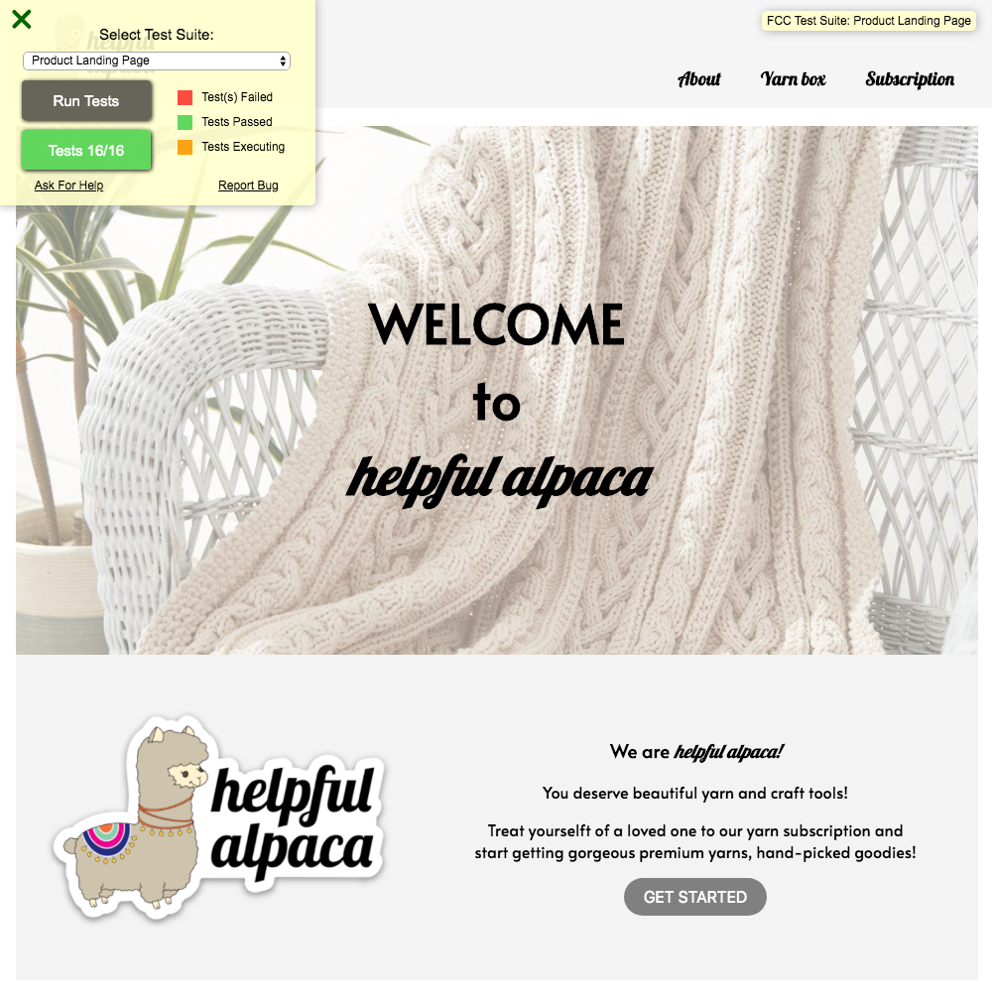
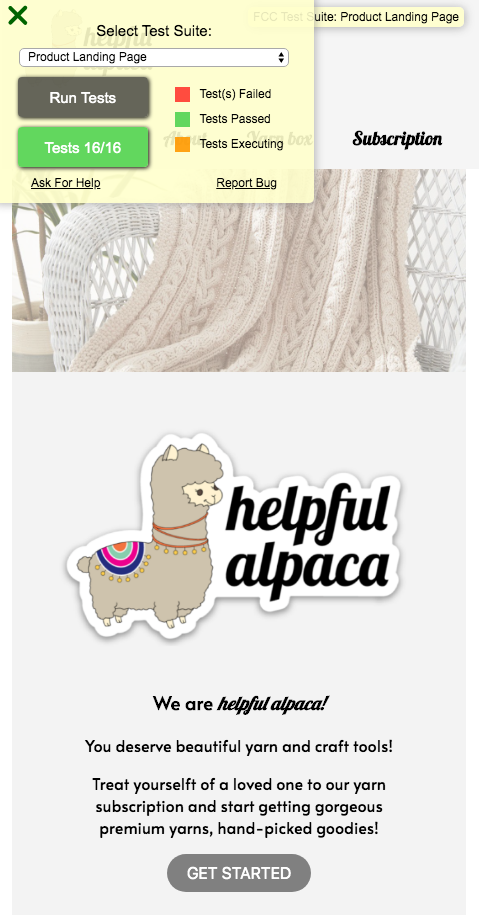

# Responsive Web Design Projects

## Build a Product Landing Page

### User Story

- **User Story #1**: My product landing page should have a header element with a corresponding `id="header"`.

- **User Story #2**: I can see an image within the header element with a corresponding `id="header-img"`. A company logo would make a good image here.

- **User Story #3**: Within the `#header` element I can see a `nav` element with a corresponding `id="nav-bar"`.

- **User Story #4**: I can see at least three clickable elements inside the `nav` element, each with the class `nav-link`.

- **User Story #5**: When I click a `.nav-link` button in the `nav` element, I am taken to the corresponding section of the landing page.

- **User Story #6**: I can watch an embedded product video with `id="video"`.
  - Plyaing a YouTube video in HTML [w3schools](https://www.w3schools.com/html/html_youtube.asp)
  ```html
  <iframe width="420" height="315" src="https://www.youtube.com/embed/tgbNymZ7vqY">
  </iframe>
  ```

- **User Story #7**: My landing page has a `form` element with a corresponding `id="form"`.

- **User Story #8**: Within the form, there is an `input` field with `id="email"` where I can enter an email address.

- **User Story #9**: The `#email` input field should have placeholder text to let the user know what the field is for.

- **User Story #10**: The `#email` input field uses HTML5 validation to confirm that the entered text is an email address.

- **User Story #11**: Within the form, there is a submit `input` with a corresponding `id="submit"`.

- **User Story #12**: When I click the `#submit` element, the email is submitted to a static page (use this mock URL: https://www.freecodecamp.com/email-submit) that confirms the email address was entered and that it posted successfully.

- **User Story #13**: The `navbar` should always be at the top of the viewport.

- **User Story #14**: My product landing page should have at least one `media query`.

- **User Story #15**: My product landing page should utilize `CSS flexbox` at least once.

- `Helpful Alpaca` is a yarn box subscription company. They provide monthly subscription program which give a box of yarn, craft tools, and pattern to help. User can choose one of three subscription options and landing page will have those information as well as helpful video and instruction to get started.
  - find company logo in `resource` folder

### Notes for future
- Used Google Font - Alata
```html
<link href='https://fonts.googleapis.com/css?family=Alata' rel='stylesheet'>
```
```css
font-family: 'Alata';
```
- Inserted Youtube video
```html
<iframe id="video" width="580" height="340" src="https://www.youtube.com/embed/SoyP-JXeDi0" frameborder="0">
</iframe>
```

- Helpful color-code for CSS
  - [w3schools](https://www.w3schools.com/colors/colors_names.asp)

- [Free stock photo - Pexels](https://www.pexels.com/)

### Snapshot
- [Codepen- helpful alpaca landing page](https://codepen.io/areumjo/pen/GRgVZdZ)

- Screenshot of the Tribute Webpage
  - 
  - 
    - for smaller screen using `@media query`